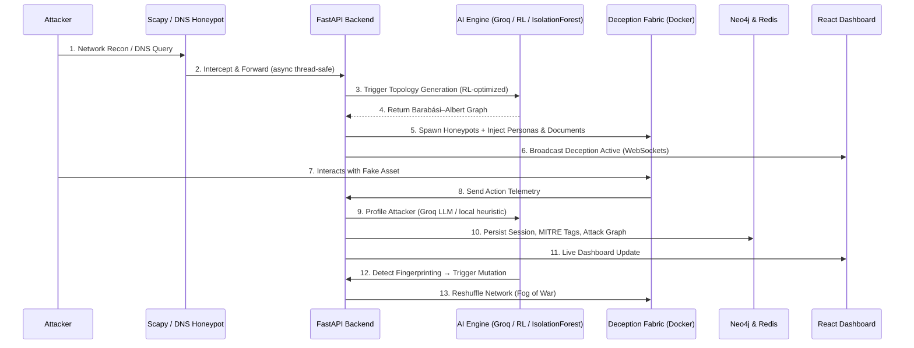

# ShadowMesh AI

## The Significance & Solution

Modern cyber defense is overwhelmingly static and reactive — analysts spend hours sifting through logs long after the attacker has breached the perimeter. **ShadowMesh** is a next-generation, AI-driven active defense platform. Instead of merely logging attacks, it dynamically weaves a deceptive network fabric around the attacker in real time.

As the attacker pivots and escalates, ShadowMesh profiles their behavior using LLM-based analysis, maps every action to the MITRE ATT&CK framework, and mutates the network topology on-the-fly to trap them in a maze of fake enterprise assets — collecting intelligence the entire time.

---

## Tech Stack

- **Backend**: Python 3.13, FastAPI, Socket.IO (ASGI), Scapy (packet sniffing), Asyncio
- **AI & Analytics**: Groq LLM (attacker profiling), NetworkX + Barabási–Albert graph model (topology), scikit-learn IsolationForest (anomaly detection), Q-learning RL optimizer (topology selection)
- **Deception Layer**: 10 fake Docker honeypots (HTTP, DB, Auth/AD, SMB, API, RDP, MQTT, Redis, Elasticsearch, SSH), canary tokens, fake credentials, synthetic personas, decoy documents
- **Intelligence**: MITRE ATT&CK tagging, STIX 2.1 export, PDF threat reports, Neo4j attack graph, SIEM integrations (Splunk, Elastic, Sentinel, CEF syslog)
- **Database & State**: Neo4j (attack graph), Redis (session persistence & hydration)
- **Frontend**: React, Vite, Zustand, react-force-graph-2d (live topology), Framer Motion
- **Infrastructure**: Docker Compose, Flask orchestrator sidecar (sole Docker socket holder)

---

## System Architecture



---

## Key Features

**Deception Fabric**
- Barabási–Albert scale-free topology generation (9–14 nodes per generation)
- Tier-1 nodes: full Docker honeypots with real network services
- Tier-2 nodes: lightweight ARP/TCP projection sensors (no container overhead)
- Adaptive lure spawning — deploys targeted honeypots based on attacker objective
- Topology mutation triggered by OS fingerprinting detection

**Human Deception (Phase 11)**
- Synthetic employee personas injected into each honeypot (name, role, department, bash history, SSH keys, AWS credentials)
- Realistic decoy documents (Payroll, AWS keys, VPN credentials, Engineering roadmaps) with embedded canary URLs
- DNS honeypot with planted canary hostnames
- 10 protocol honeypots: HTTP, DB, Auth/AD, SMB, API Gateway, RDP, MQTT, Redis, Elasticsearch, SSH

**AI Intelligence**
- Groq LLM attacker profiling (skill level, objective, APT resemblance, tools detected)
- Local heuristic fallback when Groq API unavailable
- IsolationForest ML anomaly scoring on every action
- Q-learning RL optimizer selects topology configuration to maximize attacker engagement
- Real-time MITRE ATT&CK technique tagging

**Intelligence Export**
- STIX 2.1 threat intelligence bundle export
- PDF threat report generation
- Neo4j attack path visualization
- SIEM integrations: Splunk HEC, Elasticsearch, Microsoft Sentinel, CEF syslog

**Dashboard**
- Live force-directed network graph with attacker glow overlays
- Real-time alert feed (critical / warning / canary / info)
- Attacker profile panel (skill, APT resemblance, ML score, confidence, tools)
- MITRE ATT&CK heatmap
- Attacker interests bar chart (credentials, AD/admins, cloud, finance, lateral)
- DNS intelligence panel with canary detection
- Breadcrumb agent tracking

---

## Quickstart

```bash
# 1. Build honeypot images (one-time, ~5 min)
bash scripts/build_images.sh

# 2. Start everything
docker-compose up --build

# 3. Open dashboard
# http://localhost:5173

# 4. Verify health
curl http://localhost:8000/health
```

**Ports:**

| Service | URL |
|---|---|
| Dashboard | http://localhost:5173 |
| Backend API | http://localhost:8000 |
| Orchestrator | http://localhost:9000 |
| Neo4j Browser | http://localhost:7474 |

---

## Biggest Technical Challenge

**State synchronization across asynchronous, high-velocity subsystems.**

Bridging low-level synchronous network sniffing (Scapy) with a high-concurrency async web framework (FastAPI) and real-time WebSockets — without dropping packets or creating race conditions — required careful architecture.

Scapy runs in a dedicated daemon thread, scheduling coroutines onto the asyncio event loop via `run_coroutine_threadsafe`. All shared state (topology, attacker profiles, action lists) is guarded by a single `asyncio.Lock`. Redis hydration ensures state survives backend restarts. The orchestrator sidecar holds the Docker socket exclusively, so the backend never blocks on container I/O.

---

## Security Hardening

- Docker socket isolated to orchestrator sidecar — backend has zero Docker access
- All honeypot containers run with `--read-only`, `cap_drop=ALL`, `no-new-privileges`, 64MB memory limit
- Attacker IP validated via `ipaddress.ip_address()` before use — no header injection
- LLM responses size-capped and sanitized before `json.loads()`
- Node IDs validated against `[a-zA-Z0-9_-]` regex before Docker operations
- X-Forwarded-For header parsed and validated, not trusted blindly
