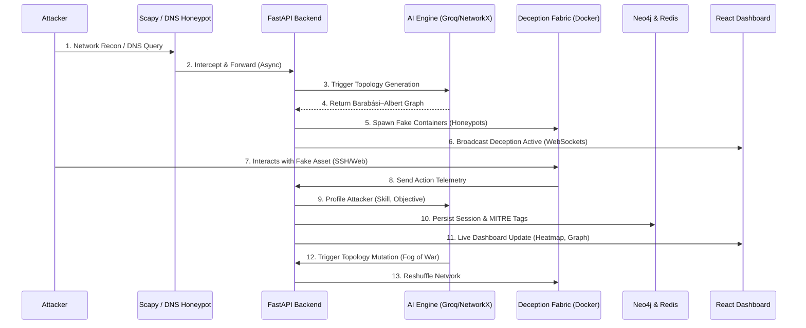

# ShadowMesh

## 🌟 The Significance & Solution
Modern cyber defense is overwhelmingly static and reactive—analysts spend hours sifting through logs long after the attacker has breached the perimeter. **ShadowMesh** is a next-generation, AI-driven active defense platform. Instead of merely logging attacks, it dynamically weaves a deceptive network fabric (a honeypot mesh) in real-time around the attacker. 

As the attacker attempts to pivot or escalate privileges, ShadowMesh analyzes their behavior using LLM-based profiling, maps their actions to the MITRE ATT&CK framework, and mutates the network topology on-the-fly to trap them in a maze of fake assets.

## 🛠 Tech Stack
- **Backend**: Python, FastAPI, WebSockets (Socket.IO), Scapy (Network Packet Sniffing)
- **AI & Analytics**: Groq LLM API (Attacker Profiling), NetworkX (Topology Generation), `scikit-learn` IsolationForest (Anomaly Detection)
- **Database & State**: Neo4j (Attack Graph Database), Redis (Session Persistence & Hydration)
- **Frontend**: React, Vite, Zustand (State Management), `react-force-graph-2d` (Live Topology), D3.js (MITRE Heatmap)
- **Infrastructure**: Docker Compose, Container Orchestration (Deception Nodes)

## 🚀 The Biggest Technical Challenge We Solved
**State Synchronization Across Asynchronous, High-Velocity Subsystems**
Bridging low-level, synchronous network sniffing (Scapy) with a high-concurrency asynchronous web framework (FastAPI) and real-time WebSockets without dropping packets or creating race conditions was incredibly difficult. 

We solved this by decoupling the ingestion layer from the processing layer. Scapy runs in a dedicated thread pool, pushing events to the `asyncio` event loop. We implemented a strict asynchronous locking mechanism (`state_lock`) and Redis hydration to ensure that our NetworkX topology, Neo4j attack graph, and the React frontend's state remain perfectly synchronized, even when the topology mutates hundreds of nodes under heavy load.

## 🗺 System Architecture & Attacker Flow

## 🔒 Security & Hardening
- **Fault-Tolerant State Recovery**: Redis-backed session persistence ensures that backend crashes or updates do not wipe active attacker tracking.
- **Resilient Database Connections**: Custom Neo4j connection loops handle database startup latency and network blips gracefully.
- **Pre-Demo Teardown Automation**: Automated container cleanup on application startup prevents dangling honeypots or resource exhaustion.
- **AI Rate-Limiting**: Heuristics trigger LLM profiling modulo 3 actions per IP, preventing API rate-limit exhaustion and controlling cost.
- **Local Anomaly Scoring**: Fast, pre-trained `IsolationForest` models evaluate zero-day anomalies locally without exposing sensitive network telemetry to external APIs.

## 🔮 Future Scope
- **STIX/TAXII Threat Intel Export**: Automated generation of standardized threat intelligence reports to share with external SIEMs.
- **Multi-Cloud Distributed Mesh**: Extending the Docker orchestrator to span AWS/GCP instances, creating a geographically distributed deception network.
- **Autonomous Credential Harvesting**: Dynamically generating hyper-realistic, personalized fake documents based on the attacker's observed LLM profile to lure them deeper into the mesh.